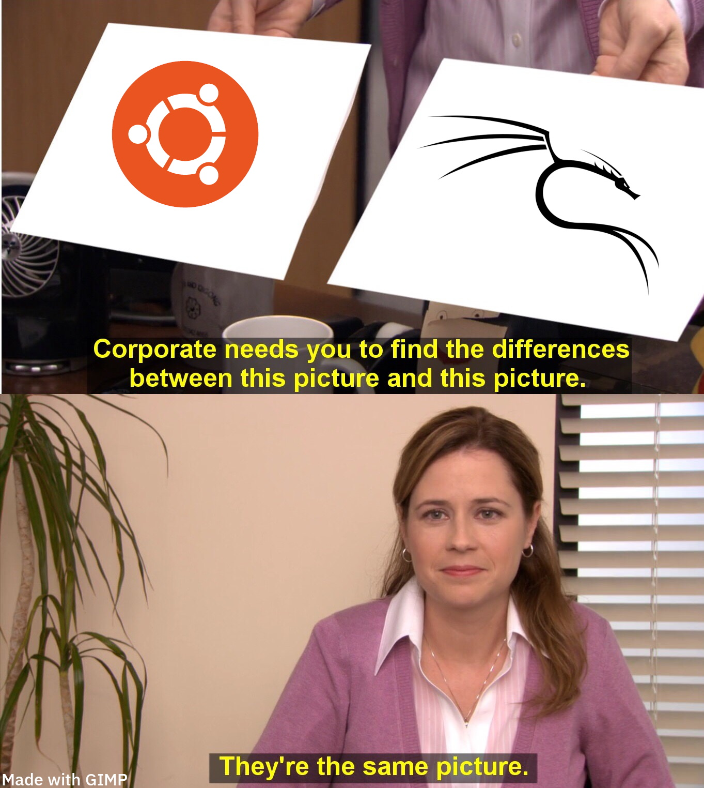

# Comment aborder un challenge ? 
<!-- footer: Frédéric Bilodeau -->
<!-- 
 -->

---
# Première étape 
Lire le titre et la question au complet (__for real ?__)

Analyse des informations reçues :
- fichiers ? 
- liens ?
- rien ? 
  - T'es sûr ? 

---
# Fichier -> message texte
- cyber chef -> un ptit coup avec magic
- decode.fr
- e, n, p, c
    - crypto ?
- encodage ? 
  - rot13 ? base64 ? 

---
# Fichier -> archive
- disque ? fichier caché ? 
- mauvaise extension (.pdf => .png) ? 
- montage du disque ? 

---
# Fichier -> image
- stéganographie ?
  - fichiers cachées ? 
  - couleurs ? 
  - meta-données ?
  - aperisolve ?  

---
# Liens

netcat est un outil qui permet de faire des requêtes de bases à un serveur. 

nc 192.168.1.100

Peut être des questions, des algorithmes, des buffers overflow et autres

---
# Liens -> Page web
- Code source ?
- field input ?
  - Sqli ? XSS ? XXE ? 
- Network Traffic ?
  - Burp Suite ? Headers ? Technos ?
  -  WireShark ? 
- JWT ?
- Cookies ? 